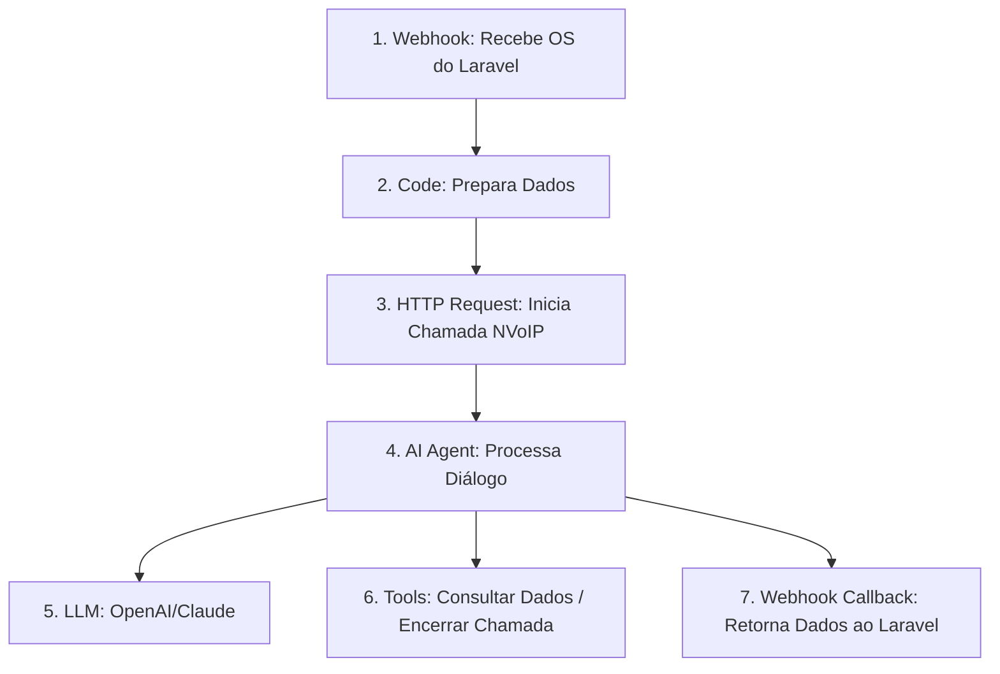

# Guia de Configuração: Fluxo Inteligente n8n + NVoIP

Este documento descreve o roteiro, o prompt da Inteligência Artificial e a estrutura dos nós no **n8n** para realizar ligações inteligentes de pós-reparo aos clientes da **ReplySys** utilizando a API da **NVoIP**.

---

## 📞 1. Objetivo da Ligação

O fluxo automatizado de voz deve:
1. Notificar o cliente de que o aparelho dele foi reparado e está pronto para retirada.
2. Informar o valor restante a ser pago (se houver).
3. Responder a dúvidas do cliente sobre o **endereço da loja** e o **horário de funcionamento**.
4. Reportar o resultado final (atendida, caixa postal, duração e notas/transcrição) de volta ao backend Laravel.

---

## 💬 2. Roteiro e Comportamento da IA (Script)

A conversa é conduzida por um agente de IA conversacional. Abaixo está o mapeamento dos diálogos esperados:

### Cenário A: Fluxo Direto (Cliente apenas confirma)
* **IA:** "Olá, [Nome do Cliente]! Aqui é a assistente virtual da ReplySys. Estou ligando para avisar que o seu [Modelo do Aparelho] já está consertado e pronto para retirada!"
* **IA:** *(Se houver saldo pendente)* "O valor restante do orçamento é de R$ [Valor Restante]. Você pode vir buscar quando quiser."
* **Cliente:** "Ah, ótimo! Muito obrigado pelo aviso. Vou passar aí hoje."
* **IA:** "Excelente! Ficamos no aguardo. Tenha um ótimo dia e até logo!"

### Cenário B: Dúvida sobre Endereço ou Horário
* **IA:** "...seu [Modelo do Aparelho] já está pronto para retirada!"
* **Cliente:** "Obrigado! Onde fica a loja mesmo? E até que horas vocês ficam abertos?"
* **IA:** "Nós ficamos na **Rua dos Reparos, nº 123, Centro - São Paulo/SP**. Nosso horário de funcionamento é de **segunda a sexta-feira, das 09h às 18h**."
* **Cliente:** "Perfeito, vou passar aí amanhã de tarde."
* **IA:** "Combinado! Estaremos te esperando. Tem mais alguma dúvida em que eu possa ajudar?"
* **Cliente:** "Não, só isso."
* **IA:** "Tenha um ótimo dia! Até mais."

---

## 🤖 3. Prompt do Sistema (System Prompt)

Configure este prompt dentro do nó do **AI Agent / LLM** no n8n para guiar a voz e as respostas da IA:

```text
Você é a assistente virtual inteligente da Sapataria Souza, uma sapataria localzada no bairro cavalhada de porto alegre.
Sua missão é ser extremamente educada, objetiva e falar em português brasileiro natural (pt-BR).

DADOS DA LIGAÇÃO:
- Cliente: {{ $json.cliente.nome }}
- Aparelho: {{ $json.item_reparado }}
- Valor a pagar: R$ {{ ($json.valor_orcamento - $json.valor_pago).toFixed(2) }}

DADOS DA LOJA (Se o cliente perguntar):
- Endereço: otto niemeyer, 3210 - cavalhada, Porto Alegre - RS.
- Horário de Funcionamento: Segunda a Sexta-feira, das 09:00 às 18:00 (Não abrimos aos sábados e domingos).

DIRETRIZES DE COMPORTAMENTO:
1. Inicie a chamada cumprimentando o cliente pelo nome e informando que o sapato dele está reparado e pronto para retirada.
2. Se o cliente perguntar sobre a localização ou horário, responda de forma clara usando estritamente os DADOS DA LOJA informados acima.
3. Mantenha as respostas curtas e naturais, adequadas para uma conversa telefônica (evite textos longos ou listas complexas).
4. Assim que o cliente confirmar que entendeu ou se despedir, finalize a chamada de forma educada e encerre a conexão.
```

---

## ⚙️ 4. Estrutura do Fluxo no n8n

Para implementar a conversa bidirecional com telefonia inteligente, o fluxo no n8n deve conter a seguinte estrutura de nós:



### Detalhamento dos Nós:

1. **Webhook Node (Laravel Trigger):**
   * **Método:** `POST`
   * **Path:** `replysys-call-trigger`
   * Recebe: `external_call_id`, `ordem_servico_id`, `cliente.nome`, `cliente.telefone`, `item_reparado`, `valor_orcamento`, `valor_pago` e `callback_url`.

2. **HTTP Request Node (NVoIP API - Torpedo de Voz / SIP Trunk):**
   * Conecta à API da NVoIP para originar a chamada telefônica para o número do cliente (`cliente.telefone`).
   * *Dica:* Para fluxos conversacionais bidirecionais (onde a IA escuta e responde), configure a chamada direcionando o áudio bidirecional para a URL do WebSocket do agente n8n ou utilize um parceiro de voz integrado (como a Vapi/Retell conectada via credenciais SIP da NVoIP).

3. **AI Agent Node (Conversational Agent):**
   * Configura a lógica de conversação usando o **System Prompt** detalhado na Seção 3.
   * Conecta a um nó de **Model (OpenAI/Anthropic)** para processamento das intenções.

4. **Nó de Encerramento (Custom Tool):**
   * Uma ferramenta (Tool) de código JavaScript simples conectada ao agente de IA. Quando o agente detecta que a conversa acabou ("tchau", "obrigado"), ele chama essa Tool para desligar a chamada ativamente na NVoIP.

5. **HTTP Request Node (Laravel Callback):**
   * Após o término da ligação (seja por encerramento natural ou falha), este nó envia o relatório final de volta para o backend Laravel:
   * **URL:** `{{ $json.callback_url }}`
   * **Método:** `POST`
   * **Payload:**
     ```json
      {
        "external_call_id": "{{ $json.external_call_id }}",
        "ordem_servico_id": {{ $json.ordem_servico_id }},
        "status_ligacao": "atendida", // atendida, caixa_postal ou falhou
        "duracao": 45, // em segundos
        "transcricao_ia": "Resumo da ligação: Cliente confirmou que o aparelho está pronto e virá buscar amanhã à tarde."
      }
      ```

---

## 🔁 5. Política de Retentativas (Retry Policy)

Caso o cliente não atenda à ligação (caixa postal, desligamento ou falha):
- O sistema agenda automaticamente uma nova chamada para **1 hora de atraso**.
- As tentativas ocorrem estritamente dentro do horário comercial: das **09:00 às 18:00**. Ligações reagendadas para após as 18:00 são postergadas para as 09:00 do dia seguinte.
- O limite total é de **4 tentativas** (1 chamada inicial + 3 retentativas). Se todas falharem, o ciclo de ligações para a OS é encerrado.
