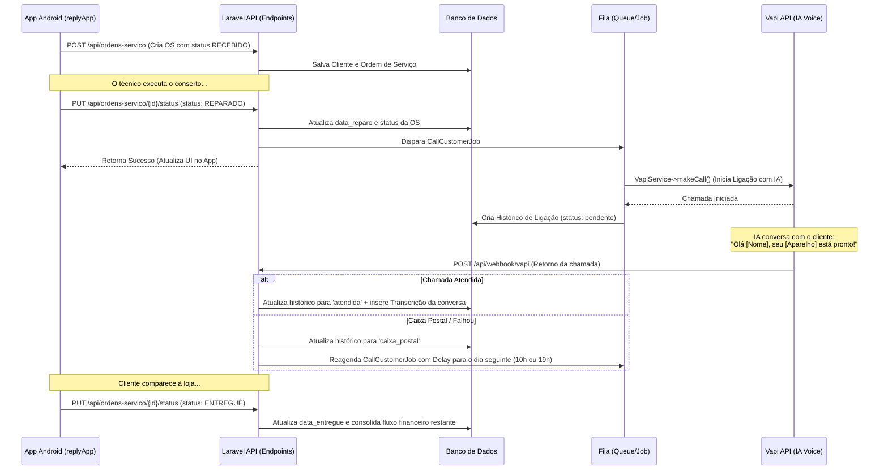

# Sistema de Controle de Reparos (ReplySys)

Sistema integrado que permite o gerenciamento de ordens de serviço, controle financeiro de receitas e despesas, e automação de ligações telefônicas via Inteligência Artificial para notificação de clientes sobre o status de seus aparelhos.

O ecossistema é composto por um backend em Laravel (com painel administrativo web) e um aplicativo móvel Android para uso dos técnicos/atendentes.

---

## 🚀 Arquitetura e Tecnologias

### Backend & Web (Laravel)
- **Framework:** Laravel 11.x
- **Banco de Dados:** MySQL/PostgreSQL (Relacional)
- **Integração Externa:** API da Vapi (Automação de chamadas de voz com IA)
- **Documentação de API:** Swagger/OpenAPI (L5-Swagger)
- **Comunicação em Fila:** Laravel Jobs & Queues (para processamento assíncrono de chamadas e retentativas)

### Mobile (Android App - `replyApp`)
- **Linguagem:** Kotlin
- **Interface Gráfica:** Jetpack Compose (Modern UI declarativa)
- **Comunicação HTTP:** Retrofit + Gson Converter
- **Gerenciamento de Estado/Ciclo de Vida:** Android ViewModel, Coroutines

---

## 🛠️ Funcionalidades Detalhadas

### 1. Painel Web & Módulo Administrativo (Laravel)
- **Dashboard Principal ([DashboardController](file:///d:/Docker/lab/replySys/app/Http/Controllers/DashboardController.php)):**
  - Exibição de métricas rápidas de Ordens de Serviço (total, em reparo, aguardando peça, recebidas, reparadas e entregues).
  - Métricas do histórico de chamadas (ligações pendentes, atendidas e enviadas para a caixa postal).
  - Listagem dos últimos serviços cadastrados e das ligações telefônicas mais recentes.
  - Indicadores financeiros dinâmicos (valores em caixa para o dia de hoje e para a semana atual).
- **Módulo Financeiro ([FinanceiroController](file:///d:/Docker/lab/replySys/app/Http/Controllers/FinanceiroController.php)):**
  - **Fluxo de Caixa Dinâmico:** O caixa é calculado em tempo real com base no recebimento de pagamentos adiantados (totais ou parciais) e no restante do pagamento efetuado no momento da entrega do aparelho (`status = ENTREGUE`).
  - **Relatório Semanal:** Histórico das últimas 8 semanas comparando receitas, despesas pagas e saldo líquido.
  - **Controle de Despesas (CRUD):** Registro de despesas com categoria, descrição, valor, data de vencimento e status (pendente ou pago).
  - **Categorização:** Gráficos/tabelas de despesas agrupadas por categoria no mês atual.

### 2. API do Backend ([routes/api.php](file:///d:/Docker/lab/replySys/routes/api.php) & [OsController](file:///d:/Docker/lab/replySys/app/Http/Controllers/Api/OsController.php))
Exposta para consumo direto pelo App Android e por serviços de Webhook:
- `GET /api/ordens-servico`: Retorna a lista de todas as Ordens de Serviço cadastradas com os dados do cliente associado.
- `POST /api/ordens-servico`: Cria uma nova Ordem de Serviço. Se o telefone informado já pertencer a um cliente existente, associa a OS a ele; caso contrário, cria um novo registro de cliente.
- `PUT /api/ordens-servico/{id}`: Atualiza os dados de uma OS e do respectivo cliente.
- `PUT /api/ordens-servico/{id}/status`: Altera o status do serviço.
  - Ao definir o status como **`REPARADO`**, a data de reparo é gravada e um Job assíncrono ([CallCustomerJob](file:///d:/Docker/lab/replySys/app/Jobs/CallCustomerJob.php)) é disparado para efetuar a ligação telefônica de aviso ao cliente.
  - Ao definir o status como **`ENTREGUE`**, a data de entrega é registrada, consolidando o fluxo financeiro do restante do pagamento.

### 3. Automação de Ligações e Webhook IA (Vapi)
- **Serviço de Chamada ([VapiService](file:///d:/Docker/lab/replySys/app/Services/VapiService.php)):**
  - Dispara requisições para a API da **Vapi.ai** (atualmente simuladas no ambiente de testes), enviando o ID do assistente, telefone do cliente e variáveis customizadas (nome do cliente e modelo do aparelho consertado).
  - Registra a ligação no histórico de chamadas (`historico_ligacoes`) com status `pendente`.
- **Processamento de Webhooks ([WebhookController](file:///d:/Docker/lab/replySys/app/Http/Controllers/WebhookController.php)):**
  - Recebe o status final e a duração da ligação diretamente da Vapi.
  - Salva a **transcrição gerada pela IA** no banco de dados e atualiza o status para `atendida` ou `caixa_postal`.
  - **Lógica de Caixa Postal:** Caso a ligação caia na caixa postal ou não seja completada, o sistema agenda automaticamente uma nova chamada para o dia seguinte, alternando os horários de forma inteligente (às 10h ou às 19h).

### 4. Aplicativo Android (`replyApp`)
- **Tela Inicial ([HomeScreen](file:///d:/Docker/lab/replySys/replyApp/app/src/main/java/com/example/replyapp/ui/HomeScreen.kt)):**
  - Lista de todas as OSs contendo: ID, Nome do Cliente, Modelo, Status e Situação Financeira (ex: "R$ 150,00 PAGO" ou "R$ 150,00 (DEVE R$ 50,00)" para pagamentos parciais).
  - Ações rápidas de alteração de status através de botões dinâmicos (botão "Concluído" se a OS estiver em andamento para mudá-la para `REPARADO`; botão "Entregar" se já estiver reparada para mudá-la para `ENTREGUE`).
  - Atalhos para atualizar a lista e abrir a tela de busca.
- **Tela de Cadastro/Edição ([CreateOsScreen](file:///d:/Docker/lab/replySys/replyApp/app/src/main/java/com/example/replyapp/ui/CreateOsScreen.kt)):**
  - Formulário completo para inserir modelo do aparelho, descrição do defeito relatado, nome e telefone.
  - **Previsão de Entrega Inteligente:** Permite escolher um dia da semana (ex: Quinta-feira) e calcula automaticamente a data correspondente para salvar no banco de dados.
  - **Máscara de Telefone Automática:** Formatação em tempo real do input numérico no padrão brasileiro `(XX) XXXXX-XXXX`.
  - **Controle de Pagamento Integrado:** Rádio botões para selecionar pagamento Pendente, Parcial ou Total. Se for Parcial, abre campo adicional para preenchimento do valor pago como adiantamento.
- **Tela de Busca ([SearchOsScreen](file:///d:/Docker/lab/replySys/replyApp/app/src/main/java/com/example/replyapp/ui/SearchOsScreen.kt)):**
  - Campo de pesquisa em tempo real filtrando instantaneamente a lista de Ordens de Serviço por nome do cliente ou modelo do aparelho.

---

## 🔄 Fluxo de Funcionamento do Ecossistema

