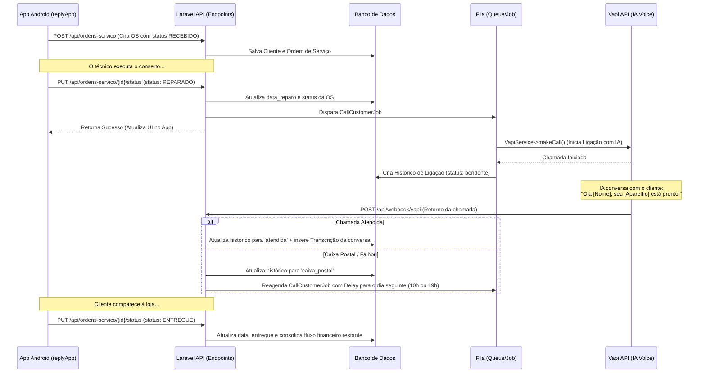

# Sistema de Controle de Reparos (ReplySys)

Sistema integrado que permite o gerenciamento de ordens de serviço, controle financeiro de receitas e despesas, e automação de ligações telefônicas via Inteligência Artificial para notificação de clientes sobre o status de seus aparelhos.

O ecossistema é composto por um backend em Laravel (com painel administrativo web) e um aplicativo móvel Android para uso dos técnicos/atendentes.

---

## 🚀 Arquitetura e Tecnologias

### Backend & Web (Laravel)
- **Framework:** Laravel 11.x
- **Banco de Dados:** MySQL/PostgreSQL (Relacional)
- **Modelagem de Dados (ORM Eloquent):**
  - [Cliente](file:///d:/Docker/lab/replySys/app/Models/Cliente.php): Representa os clientes, com relacionamentos de um para muitos com as ordens de serviço.
  - [OrdemServico](file:///d:/Docker/lab/replySys/app/Models/OrdemServico.php): Controla os aparelhos, status, valores e datas.
  - [Despesa](file:///d:/Docker/lab/replySys/app/Models/Despesa.php): Gerencia o controle financeiro de saídas de caixa.
  - [HistoricoLigacao](file:///d:/Docker/lab/replySys/app/Models/HistoricoLigacao.php): Registra logs de chamadas e transcrições geradas pela IA.
- **Integração Externa:** API da Vapi (Automação de chamadas de voz com IA)
- **Documentação de API:** Swagger/OpenAPI (L5-Swagger) configurado no controlador de APIs [OsController](file:///d:/Docker/lab/replySys/app/Http/Controllers/Api/OsController.php) e no [WebhookController](file:///d:/Docker/lab/replySys/app/Http/Controllers/WebhookController.php) utilizando atributos PHP (`OpenApi\Attributes`).
- **Comunicação em Fila:** Laravel Jobs & Queues (para processamento assíncrono de chamadas e retentativas) via [CallCustomerJob](file:///d:/Docker/lab/replySys/app/Jobs/CallCustomerJob.php).

### Mobile (Android App - `replyApp`)
- **Linguagem:** Kotlin
- **Interface Gráfica:** Jetpack Compose (Modern UI declarativa com suporte a temas e visualização dinâmica)
- **Navegação & Fluxo:** Controlados de forma reativa na [MainActivity](file:///d:/Docker/lab/replySys/replyApp/app/src/main/java/com/example/replyapp/MainActivity.kt).
- **Comunicação HTTP:** Retrofit + Gson Converter definidos em [ApiService.kt](file:///d:/Docker/lab/replySys/replyApp/app/src/main/java/com/example/replyapp/api/ApiService.kt).
- **Gerenciamento de Estado/Ciclo de Vida:** Android ViewModel ([HomeViewModel](file:///d:/Docker/lab/replySys/replyApp/app/src/main/java/com/example/replyapp/ui/HomeScreen.kt#L22) e [CreateOsViewModel](file:///d:/Docker/lab/replySys/replyApp/app/src/main/java/com/example/replyapp/ui/CreateOsScreen.kt#L98)), Coroutines.

---

## 🛠️ Funcionalidades Detalhadas

### 1. Painel Web & Módulo Administrativo (Laravel)
- **Dashboard Principal ([DashboardController](file:///d:/Docker/lab/replySys/app/Http/Controllers/DashboardController.php)):**
  - **Métricas Rápidas de OS:** Exibe o total geral de Ordens de Serviço e contadores individuais por status (`RECEBIDO`, `EM_REPARO`, `AGUARDANDO_PECA`, `REPARADO`, `ENTREGUE`).
  - **Métricas do Histórico de Chamadas:** Totalizadores de chamadas nos status `pendente`, `atendida` e `caixa_postal`.
  - **Listagens Recentes:** Tabela dos últimos 6 serviços cadastrados e das últimas 6 chamadas telefônicas realizadas.
  - **Indicadores de Caixa:** Valores financeiros calculados para o dia de hoje e para a semana atual (segunda a domingo).
- **Módulo Financeiro ([FinanceiroController](file:///d:/Docker/lab/replySys/app/Http/Controllers/FinanceiroController.php)):**
  - **Fluxo de Caixa Dinâmico:** Implementado no método `getCashForPeriod` de [OrdemServico](file:///d:/Docker/lab/replySys/app/Models/OrdemServico.php), calcula as entradas em tempo real somando:
    1. Pagamentos adiantados (totais ou parciais) efetuados no momento do cadastro da OS (baseado em `created_at`).
    2. O restante do pagamento (valor do orçamento menos o adiantamento) consolidado quando a OS é entregue (`status = ENTREGUE` baseado em `data_entregue` ou `updated_at`).
  - **Relatório Semanal:** Histórico detalhado das últimas 8 semanas comparando a receita total, despesas pagas e saldo líquido.
  - **Gerenciamento de Despesas:** Rotas em [web.php](file:///d:/Docker/lab/replySys/routes/web.php) para listar, criar (`store`), registrar pagamento (`pagar`) e excluir (`destroy`) despesas cadastradas (não possui rota de edição/atualização geral de campos).
  - **Categorização Mensal:** Tabela agrupando despesas pagas por categoria (energia, aluguel, salários, etc.) no mês corrente.

### 2. API do Backend ([api.php](file:///d:/Docker/lab/replySys/routes/api.php) & [OsController](file:///d:/Docker/lab/replySys/app/Http/Controllers/Api/OsController.php))
Exposta para consumo direto pelo App Android e por serviços de Webhook:
- `GET /api/ordens-servico`: Retorna a lista de todas as Ordens de Serviço cadastradas com os dados do cliente associado.
- `POST /api/ordens-servico`: Cria uma nova Ordem de Serviço. Se o telefone informado já pertencer a um cliente existente, associa a OS a ele; caso contrário, cria um novo registro de cliente. Suporta inserção de valores de orçamento e sinal de pagamento.
- `PUT /api/ordens-servico/{id}`: Atualiza os dados de uma OS e do respectivo cliente (nome, telefone, modelo, defeito, valor, status de pagamento).
- `PUT /api/ordens-servico/{id}/status`: Altera o status da OS.
  - Ao definir o status como **`REPARADO`**, a data de reparo é gravada e o job assíncrono [CallCustomerJob](file:///d:/Docker/lab/replySys/app/Jobs/CallCustomerJob.php) é disparado para efetuar a ligação telefônica de aviso ao cliente.
  - Ao definir o status como **`ENTREGUE`**, a data de entrega é registrada, consolidando o fluxo financeiro do restante do pagamento.

### 3. Automação de Ligações e Webhook IA (Vapi)
- **Serviço de Chamada ([VapiService](file:///d:/Docker/lab/replySys/app/Services/VapiService.php)):**
  - Prepara a requisição para a API da **Vapi.ai**, enviando o ID do assistente, telefone do cliente e variáveis customizadas (`nome_cliente` e `item_reparado`).
  - Atualmente simula a chamada no ambiente local criando um histórico de ligação ([HistoricoLigacao](file:///d:/Docker/lab/replySys/app/Models/HistoricoLigacao.php)) com status `pendente`.
- **Processamento de Webhooks ([WebhookController](file:///d:/Docker/lab/replySys/app/Http/Controllers/WebhookController.php)):**
  - Recebe o status final e a duração da ligação diretamente do webhook da Vapi.
  - Salva a **transcrição gerada pela IA** no banco de dados e atualiza o status para `atendida` ou `caixa_postal`.
  - **Lógica de Caixa Postal:** Caso a ligação caia na caixa postal ou não seja completada, o sistema agenda automaticamente uma nova chamada para o dia seguinte, alternando de forma aleatória o horário (10h ou 19h) através de um delay no job [CallCustomerJob](file:///d:/Docker/lab/replySys/app/Jobs/CallCustomerJob.php).

### 4. Aplicativo Android (`replyApp`)
- **Tela Inicial ([HomeScreen.kt](file:///d:/Docker/lab/replySys/replyApp/app/src/main/java/com/example/replyapp/ui/HomeScreen.kt)):**
  - Lista de todas as OSs contendo: ID, Nome do Cliente, Modelo, Status e Situação Financeira (ex: "R$ 150,00 PAGO", "R$ 150,00 (DEVE R$ 50,00)" para pagamentos parciais, ou apenas o valor para pendente).
  - Ações rápidas de alteração de status através de botões dinâmicos (botão "Concluído" se a OS estiver em andamento para mudá-la para `REPARADO`; botão "Entregar" se já estiver reparada para mudá-la para `ENTREGUE`).
  - Atalhos para atualizar a lista e abrir a tela de busca.
- **Tela de Cadastro/Edição ([CreateOsScreen.kt](file:///d:/Docker/lab/replySys/replyApp/app/src/main/java/com/example/replyapp/ui/CreateOsScreen.kt)):**
  - Formulário completo para inserir modelo do aparelho, descrição do defeito, nome do cliente e telefone.
  - **Previsão de Entrega Inteligente (`generatePrevisaoOptions`):** Calcula opções dinâmicas de dias de entrega de segunda a sexta para a semana atual e seguinte, pulando sábados e domingos. Ao editar, preserva e formata a data cadastrada anteriormente.
  - **Máscara de Telefone Automática (`formatPhone`):** Formata dinamicamente o número digitado no padrão brasileiro de telefonia móvel `(XX) XXXXX-XXXX` ou fixa `(XX) XXXX-XXXX` até 11 dígitos.
  - **Controle de Pagamento Integrado:** Rádio botões para selecionar pagamento Pendente, Parcial ou Total. Se for Parcial, abre campo adicional para preenchimento do valor pago como adiantamento.
- **Tela de Busca ([SearchOsScreen.kt](file:///d:/Docker/lab/replySys/replyApp/app/src/main/java/com/example/replyapp/ui/SearchOsScreen.kt)):**
  - Campo de pesquisa em tempo real filtrando instantaneamente a lista de Ordens de Serviço por nome do cliente ou modelo do aparelho (ignora maiúsculas e minúsculas).
  - Permite realizar ações rápidas (Editar, Concluído, Entregar) diretamente dos cards filtrados.

---

## 🔄 Fluxo de Funcionamento do Ecossistema

